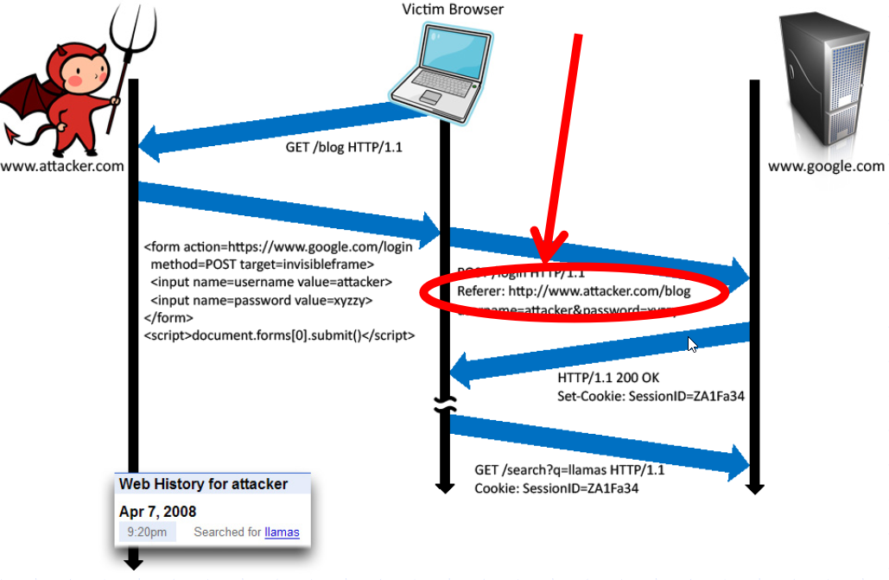

HTTP/TLS
=========

`TLS/SSL` 是一個加密的協議，讓雙方的通訊已被加密的狀態進行。最常見的使用情境是使用在 `HTTP` 協議上，也就是 `HTTPS`。`HTTPS` 協議確保以下三項：

* 隱私
* 認證
* 資料一致性

在 Go 語言中，對應的實作會在 `crypto/tls` 套件，在本章節中，我們將重點性的介紹 Go 的實作和使用方法。雖然協議本身設計的理論和加密的實作超過了本文的範圍，你還是可以在 [Cryptography Practices][1] 章節中找到相關的資訊。

下面是一個在 `HTTP` 使用 `TLS` 的範例：

```go
import "log"
import "net/http"

func main() {
  http.HandleFunc("/", func (w http.ResponseWriter, req *http.Request) {
    w.Write([]byte("This is an example server.\n"))
  })

  // yourCert.pem - path to your server certificate in PEM format
  // yourKey.pem -  path to your server private key in PEM format
  log.Fatal(http.ListenAndServeTLS(":443", "yourCert.pem", "yourKey.pem", nil))
}
```

這是一個在伺服器端使用 SSL 的範例，值得注意的是，這個案例在 SSL Labs 中得到了 "A" 的評價。

為了進一步提高安全性，你可以在 header 中加入以下欄位，強制執行 HSTS (HTTP Strict Transport Security)。

```go
w.Header().Add("Strict-Transport-Security", "max-age=63072000; includeSubDomains")
```

Go 的 TLS 實作是在 `crypto/tls` 套件中，當使用 TLS 時，請確保使用單一標準的 TLS 有被正確的設定。

根據前面的範例，我們再來實作 SNI(Server Name Indication)：

```go
...
type Certificates struct {
    CertFile    string
    KeyFile     string
}

func main() {
    httpsServer := &http.Server{
        Addr: ":8080",
    }

    var certs []Certificates
    certs = append(certs, Certificates{
        CertFile: "../etc/yourSite.pem", //Your site certificate key
        KeyFile:  "../etc/yourSite.key", //Your site private key
    })

    config := &tls.Config{}
    var err error
    config.Certificates = make([]tls.Certificate, len(certs))
    for i, v := range certs {
        config.Certificates[i], err = tls.LoadX509KeyPair(v.CertFile, v.KeyFile)
    }

    conn, err := net.Listen("tcp", ":8080")

    tlsListener := tls.NewListener(conn, config)
    httpsServer.Serve(tlsListener)
    fmt.Println("Listening on port 8080...")
}
```

注意，當你使用 TLS 時，證書必須要是合法的，包含了正確的域名，同時不能過期，當必要時，要安裝中間憑證。更多資訊可以參考 [OWASP SCP Quick Reference Guide][2] 中的描述。

**重要:** 不合法的 TLS 憑證應該要被拒絕，確保 `InsecureSkipVerify` 設定在正式環境上沒有被設定為 `true`。如下面的程式碼片段：

```go
config := &tls.Config{InsecureSkipVerify: false}
```

設定正確的域名：

```go
config := &tls.Config{ServerName: "yourHostname"}
```

另外一個關於 TLS 的攻擊是 POODLE。這個攻擊主要是由於客戶端不支援伺服器端的加密方式，因而伺服器端會配合客戶端降低加密方法。這樣會造成連線容易被攻擊。

默認情況下，Go 會禁止 SSLv3，並透過以下方法可以設定加密的最小及最大版本：

```go
// MinVersion contains the minimum SSL/TLS version that is acceptable.
// If zero, then TLS 1.0 is taken as the minimum.
  MinVersion uint16
```

```go
// MaxVersion contains the maximum SSL/TLS version that is acceptable.
// If zero, then the maximum version supported by this package is used,
// which is currently TLS 1.2.
MaxVersion uint16
```

你可以使用 [SSL Labs][4] 來檢查密碼的安全性。

另一個用來防止這種攻擊的方式是在 [RFC7507][3] 中定義的 TLS_FALLBACK_SCSV。在 Go 中，不支援降級的機制。

根據 Google 的開發者 Adam Langley 表示：

> Go 的客戶端不會降級連線，所以不需要傳送 TLS_FALLBACK_SCSV。

另一個攻擊稱為 CRIME，是透過壓縮來達到攻擊的目的。壓縮是核心協定的功能之一，但他是可選、非必需的。使用 Go 所寫的程式可能不會受到影響，因為目前 `crytpo/tls` 套件並沒有支援壓縮的機制。要特別注意的是，如果你使用了外部有關於資訊安全方面的套件，那有可能是不安全的。

另外一個 TLS 的部分是關於連線的重新協議。為了確保沒有不安全的連線會被建立，請使用 `GetClientCertificate` 及其相關連的處理錯誤的程式碼，以防止 handshake 失敗。透過他，可以捕捉錯誤程式碼，並且防止使用不安全的通道。

所有的請求也應該預先編碼，例如使用 UTF-8，你可以在 header 中設定：

```go
w.Header().Set("Content-Type", "Desired Content Type; charset=utf-8")
```

另外一個部分是，在處理 HTTP 連線到外部網站時，header 沒有包含任何敏感的資訊。當連線沒有加密時，HTTP header 裡面的資訊很有可能會被洩露。


圖片來源 : [John Mitchell][5]

[1]: ../cryptography-practices/README.md
[2]: https://www.owasp.org/images/0/08/OWASP_SCP_Quick_Reference_Guide_v2.pdf
[3]: https://tools.ietf.org/html/rfc7507
[4]: https://ssllabs.com/
[5]: https://crypto.stanford.edu/cs155old/cs155-spring14/lectures/09-web-site-sec.pdf
