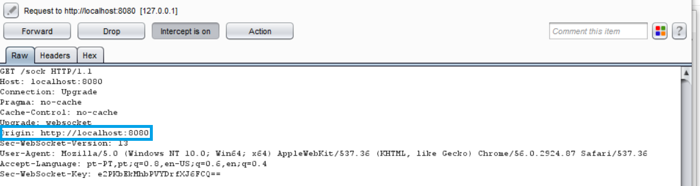
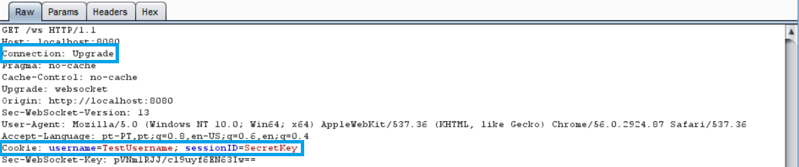
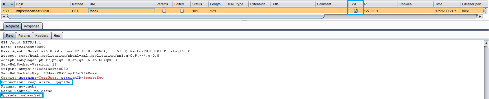
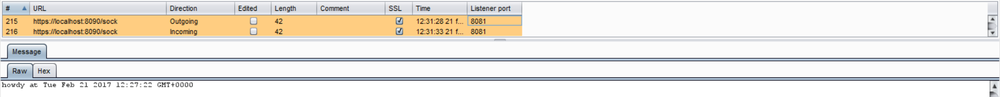

WEBSOCKETS
==========

WebSocket 是一個為了 HTML5 所定義的全雙工的通訊模式。透過 WebSocket，，瀏覽器和伺服器淑芳都可以在一個 TCP 通道中傳送非同步的訊息，而不需要使用 _long polling_ 或 _comet_ 的方式。

本質上，Websocket 是一個在伺服器和客戶端之間標準的 TCP socket 連線，這個 socket 會先透過一個標準的 HTTP 進行請求，之後再 "Upgrade" 到一個 TCP socket。在順利 handshake 之後，雙方便可以開始傳輸資料。

## 原始的 Header

在 HTTP header 中的 `Origin` 用來確保 Websocket 接受的連線是來自於可信任的域名，否則可能會產生 Cross Site Request Forgery (CSRF) 問題。

在 HTTP Websocket 初始化時確保 `Origin` 是正確的是伺服器端的責任，如果伺服器沒有驗證 header，那該 websocket 連線很有可能被其他不合法的源站(origin)攻擊。

下面的範例中提供一個範例，作為檢查 `Origin` 之用，避免 CSWSH (Cross-Site WebSocket Hijacking) 攻擊：



應用程式應該要檢查 `Host` 和 `Origin`，確保請求的來源是來自於合法的 `Host`，其他的連線則應該拒絕。

一個簡單的範例如下：

```go
// 檢查來源的 Origin
if r.Header.Get("Origin") != "http://"+r.Host {
  http.Error(w, "Origin not allowed", 403)
    return
} else {
    websocket.Handler(EchoHandler).ServeHTTP(w, r)
}
```

## 保密與資料一致性

Websocket 的通道可以是未加密的 TCP 或是加密的 TLS。

當使用未加密的 websocket 時，URI 的標示符號是 `ws://`，預設的連接阜是 `80`。如果使用加密的 websocket，URI 標示符是 `wss://`，預設的連接阜是 `443`。

當使用 websocket 時，我們必須要考慮使用加密或未加密的連線。

在本章節中我們會展示當一個連線從 HTTP 升級為 websocket 連線：



注意該連線的 header 中包含了 cookie 資訊，因此我們應該使用加密的 TLS 連線：



在第二個範例中，我們使用的 websocket 連線是使用 SSL 加密：



## 認證與授權

Websocket 不處理認證或授權，這意味著我們必須使用 cookie、HTTP 認證或 TLS 認證等方式來確保安全。更多的資訊可以在 [認證][1] 和 [存取控制][2] 等章節中獲得。

## 輸入資料清理

就像任何從非信任的來源得到的資料一樣，從 websocket 收到的資料也應該被清理和編碼。更多的資訊可以參考 [資料清理][3] 和 [輸出編碼][4] 等章節。

[1]: ../authentication-password-management/README.md
[2]: ../access-control/README.md
[3]: ../input-validation/sanitization.md
[4]: ../output-encoding/README.md
