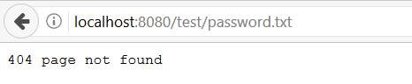
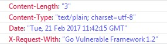

系統設定
====================

保持更新到最新版本是資安的關鍵。考慮到這一點，開發者應該將 Go 的版本及外部引用到的套件更新到最新版。

關於在 Go 中的任何 HTTP 請求，你必須要知道他們會是 HTTP/1.1 或 HTTP/2。即使你指定 HTTP/1.0：

```go
req, _ := http.NewRequest("POST", url, buffer)
req.Proto = "HTTP/1.0"
```

[Proto][3] 將會忽略你的設定，還是使用 HTTP/1.1 來進行請求(譯注：可參考原始碼：[https://github.com/golang/go/blob/master/src/net/http/request.go#L117-L124](https://github.com/golang/go/blob/master/src/net/http/request.go#L117-L124))。

## 目錄清單瀏覽

當開發者忘記將目錄清單瀏覽的功能關閉時(OWASP 稱之為 [Directory Indexing][4])，攻擊者可以透過瀏覽目錄來取得敏感性的資料。

如果你使用 Go 來建立網頁伺服器時，你需要注意：

```go
http.ListenAndServe(":8080", http.FileServer(http.Dir("/tmp/static")))
```

如果你呼叫 `localhost:8080`，他會打開 index.html 的檔案，但想像一下如果當中有敏感性的資料會如何？如下所示：


為什麼會發生這樣的事情？Go 會嘗試在目錄中去找 `index.html`，當檔案不存在時，就會列出整個目錄(譯註：當你的 `/tmp/static` 目錄中不存在 index.html 時，就會列出整個目錄裡面的檔案和資料夾)。

有三個方法可以解決這樣的問題：

* 停用目錄清單瀏覽的功能
* 限制存取的檔案和目錄
* 每一個目錄都建立一個 index 檔案

在本章節中，我們會展示如何停用目錄清單的功能。首先，建立一個函式用來檢查請求的路徑是否可以被存取：


```go
type justFilesFilesystem struct {
    fs http.FileSystem
}

func (fs justFilesFilesystem) Open(name string) (http.File, error) {
    f, err := fs.fs.Open(name)
    if err != nil {
        return nil, err
    }
    return neuteredReaddirFile{f}, nil
}
```

接著我們可以繼續使用 `http.ListenAndServe`：

```go
fs := justFilesFilesystem{http.Dir("/tmp/static/")}
http.ListenAndServe(":8080", http.StripPrefix("/tmp/static", http.FileServer(fs)))
```

現在我們的應用系統只允許顯示 `tmp/static` 的請求路徑，當我們嘗試存取其他路徑時，將會得到以下訊息：



假設我們嘗試存取 `test/` 目錄時，一樣會得到相同的錯誤：


## 移除/停用你不需要的功能

在正式環境中，移除所有你不需要使用到的功能或檔案。任何測試程式碼或函式都不應該存在於即將部署到正式環境的程式碼中。

HTTP 回應的 header 也應該要被檢查。移除任何會揭露敏感資訊的 header 欄位，例如：

* 作業系統版本
* 網站伺服器版本
* 使用的程式語言框架或版本



攻擊者可以從這些資訊找出對應版本所揭露的漏洞，因此，最好的方式就是移除這些敏感資訊。

在預設的情況下，Go 不會揭露這些敏感資訊，然而，如果你使用外部套件，別忘了再確認一下。

試著找看看類似以下的資訊：

```go
w.Header().Set("X-Request-With", "Go Vulnerable Framework 1.2")
```

你可以搜尋程式碼中是否有類似的 HTTP header，將他們移除。

同樣的，你可以定義你的網頁伺服器只支援特定的 HTTP 方法，例如，你只打算支援 POST 和 GET，就可以定義：

```go
w.Header().Set("Access-Control-Allow-Methods", "POST, GET")
```

不要擔心停用像是 WebDAV這樣的功能，因為如果你要提供一個 WebDAV 的伺服器時，你需要引用[特定的套件][2]

## 實作更好的安全機制

將你的心態放在遵循伺服器、流程和帳號的[最低權限原則][1]。

注意網頁伺服器的錯誤處理部分，當發生錯誤例外時，讓他們安全的被處理。請參考本書的[錯誤處理與日誌][5]章節。

防止你的 `robots.txt` 檔案中的目錄結構被洩漏。`robots.txt` 是一個目標文件，並不是用來做安全控制的。你可以在 `robots.txt` 檔案中採取白名單模式：


```
User-agent: *
Allow: /sitemap.xml
Allow: /index
Allow: /contact
Allow: /aboutus
Disallow: /
```

上面的範例中允許任何 user-agent 或是爬蟲機器人來索引任何特定的頁面，但是其他的則拒絕。這樣的話你可以不洩漏一些帶有敏感性資料的頁面，比如說：管理者頁面或呈現重要資料的頁面。

將你的開發環境和正式環境的網路進行隔離。提供正確的存取權限給開發者和測試者，並且建立更好的安全層來保護他們。一般來說，開發環境會比正式環境來得容易被攻擊。

最後一個重要的事情是記得要使用版本管理系統來記錄所有開發和正式環境的程式碼變更。Github，或是其他類似的版本管理系統可以達到這樣的目的。

## 資產管理系統:

儘管 `資產管理系統` 並非 Go 語言特定的問題，但我們會在下方提及它簡短的概念。

`資產管理` 包括了組織為了達到其資產最佳化而進行的一系列活動，同時包含了每個資產所需要的安全水準。應該注意的是，在本章節中所提到的資產，並不僅僅是系統中的元件，而是包含了整個軟體部分。

要實現這樣的系統會包含以下幾個步驟：

1. 在企業中建立資訊安全的重要性。
2. 定義 AMS 的範圍。
3. 定義資訊安全策略。
4. 定義資訊安全的組織架構。
5. 針對資產定型定義與分類。
6. 確定和評估資產的風險。
7. 規劃風險管理。
8. 實施風險緩解策略。
9. 撰寫適用性聲明。
10. 訓練員工建立安全意識。
11. 監控並檢視 AMS 的成效。
12. 維護 AMS，並確保其持續改善。

更深入的分析與實作可以參考[這一篇文章][5]。

[1]: https://www.owasp.org/index.php/Least_privilege
[2]: https://godoc.org/golang.org/x/net/webdav
[3]: https://golang.org/pkg/net/http/#Request
[4]: https://www.owasp.org/index.php/OWASP_Periodic_Table_of_Vulnerabilities_-_Directory_Indexingi
[5]: https://www.giac.org/paper/gsec/2693/implementation-methodology-information-security-management-system-to-comply-bs-7799-requi/104600)
